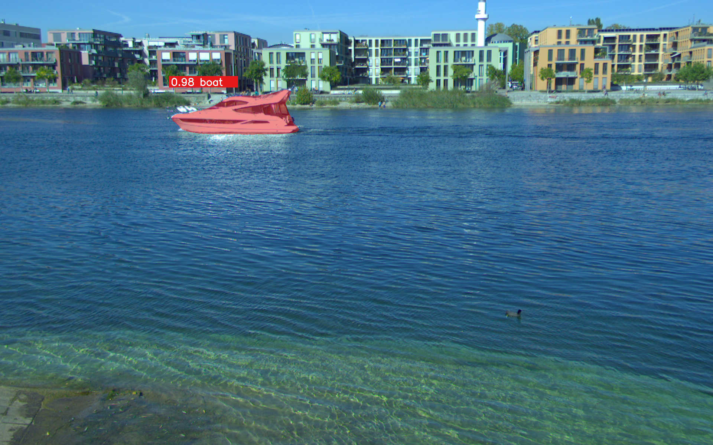
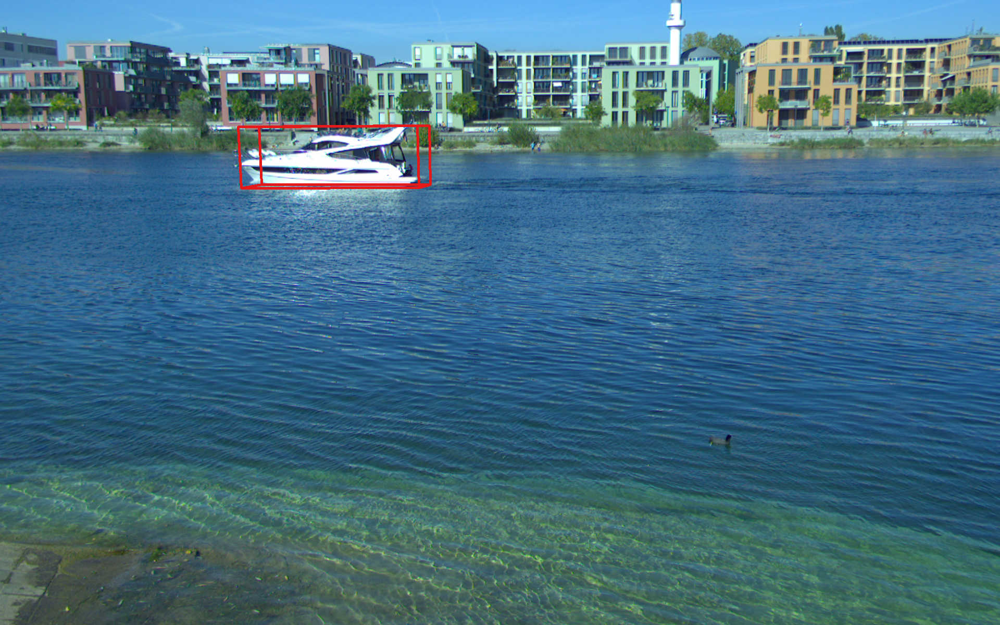

# Monocular 3D Object Detection with Inverse Projection

[](https://img.shields.io/badge/license-BSD--3--Clause-blue?style=flat-square)
[](https://www.python.org/downloads/)

This repository contains the official implementation of the paper **"CNN-based Monocular 3D Ship Detection using Inverse Perspective"**.

Our approach estimates **3D bounding boxes** of objects using a single camera image (monocular). By leveraging camera intrinsics and the assumption of a known ground plane (e.g., water surface), the system utilizes **Inverse Projection** to accurately localize objects in 3D space.

While our paper demonstrates the method on **vessel detection**, the framework is generic and applicable to any object class present in the **COCO dataset**.

## 🖼️ Results

<p float="left">
  
   
</p>

### ⚠️ Important Note on Coordinate Systems

The algorithm strictly assumes that both the **plane** and the **camera coordinate systems** follow the standard computer vision convention:
* **X:** Right
* **Y:** Down
* **Z:** Front (Optical Axis)


*Please ensure your calibration data matches this convention to avoid projection errors.*

## ⚙️ Installation

We recommend using Anaconda to manage the environment.

1. **Clone the repository:**
   ```bash
   git clone https://github.com/dionysos4/monocular-3d-detection.git
   cd /monocular-3d-detection
   ```

2. **Create and activate the environment:**
   ```bash
    conda create --name monocular3d python=3.9
    conda activate monocular3d
   ```

3. **Install the package:**
   ```bash
    pip install .
   ```

## 🚀 Getting Started

To run the detection pipeline with default settings:

```bash
python3 pipeline.py
```

## Citation

```bibtex
@inproceedings{griesser2020cnn,
  title={CNN-based monocular 3D ship detection using inverse perspective},
  author={Griesser, Dennis and Dold, Daniel and Umlauf, Georg and Franz, Matthias O},
  booktitle={Global Oceans 2020: Singapore--US Gulf Coast},
  pages={1--8},
  year={2020},
  organization={IEEE}
}
```